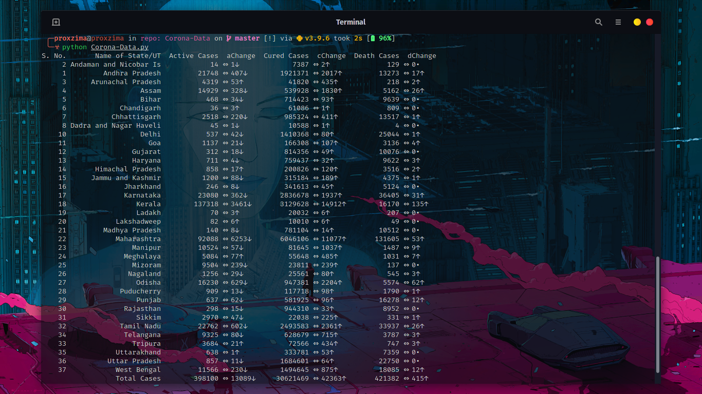

# Corona-Data
## Basic Info
This Python 3.8 based program provides a Two-dimensional tabular data as well as a graph of Cases in India and of the respective states

Hope you have Python 3.8 installed
## Installation
* If you have git installed, to clone do the following in the Command Prompt
```
git clone https://github.com/PROxZIMA/Corona-Data.git
```
Now change the directiory to the folder 'Corona-Data'
```
cd ./Corona-Data
```
* If you dont have git then just download the repository, unzip it, go to the folder `Corona-Data` and open Command Prompt in that folder. To open Command Prompt press `Shift + Right Click` anywhere the folder window. Select `Open command windows here` option from the context menu

After any of the above to steps you'll be in the Command Prompt. Before running the file very first time just type this in the Command Prompt.
```
pip install -r requirements.txt
```
Wait for the process to complete. After that run the main file using
```
python Corona-Data.py
```
No need to type `pip install -r requirements.txt` again. Just use `python Corona-Data.py`

That's it. Enjoy!!
___
## Images


